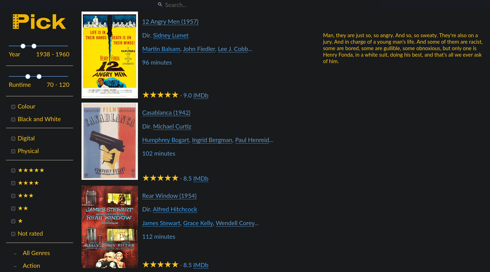
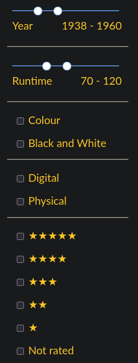
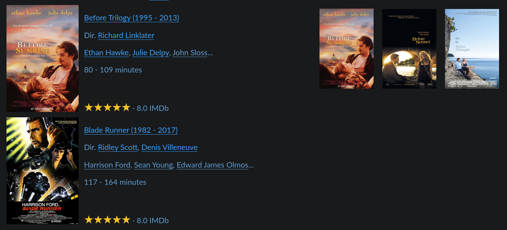

# Pick

Pick is a media browser, built using django.

## Features

Hover over a thumbnail to see a description of the film and
click on the stars to rate it.



Films can be filtered by year, runtime, black and while/colour, digital/physical
availability and by user rating.



You can also filter by genre, using `AND`, `OR` and `NOT` filters. This allows
you to require or exclude genre(s).


Films can be grouped into series. You can then click through to see all the series members.



## Install

```
python -m venv .venv
source .venv/bin/activate 
python -m pip install -r requirements.txt
```

You may need to either copy or link `el-pagination.js` from the venv into `static`, for example:
```
ln -s .venv/lib/python3.12/site-packages/el_pagination/static/el-pagination/js/el-pagination.js mediabrowser/static/mediabrowser/js/el-pagination.js
```

## Make DB

To make the database:
```
./manage.py makemigrations mediabrowser
./manage.py migrate
```

Use `scripts/pop_db.py` to populate the database. The simplest input can be
a list of filenames (for example, the output of `ls` piped into a file); use the
`-f` arg to supply this. `Pick` searches IMDb for matching films.

To override the automatically found IMDb IDs for any file, you can also supply a `patch.csv`. This also allows you to manually specify any other data fields.

For example:
```
scripts/pop_db.py -f films.txt -p patch.csv
```

See `scripts/pop_db.py -h` for full usage.

## Test

```
./manage.py test mediabrowser -v 2
```

## Run on local network

```
./manage.py runserver 0.0.0.0:8000
```

To view on another machine on the network, add the IP address to `ALLOWED_HOSTS` in settings.py.